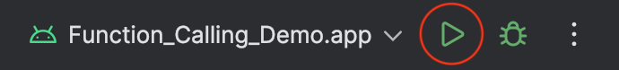
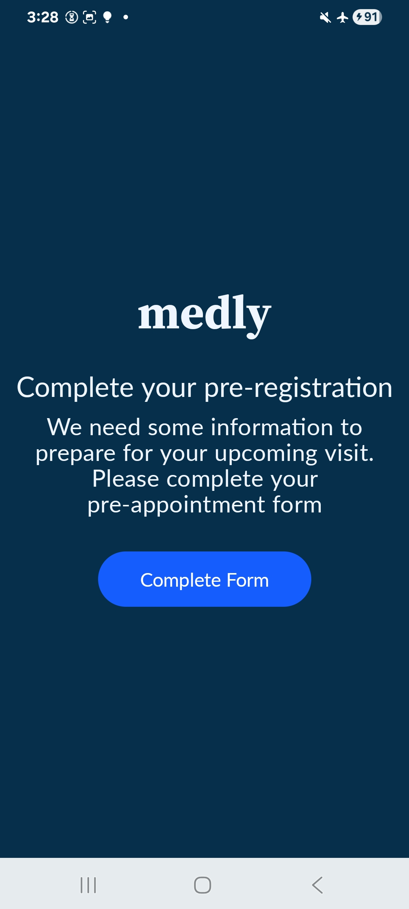
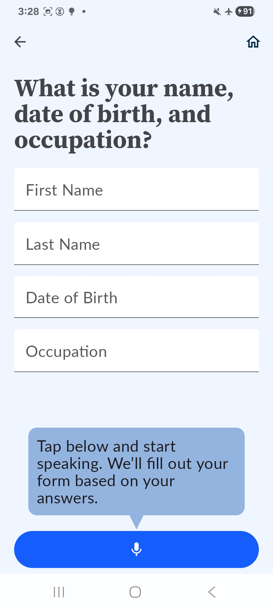
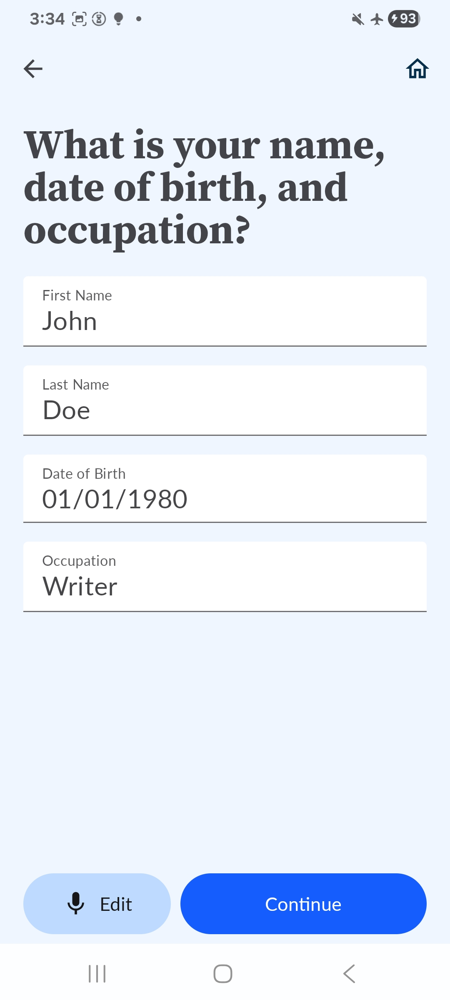
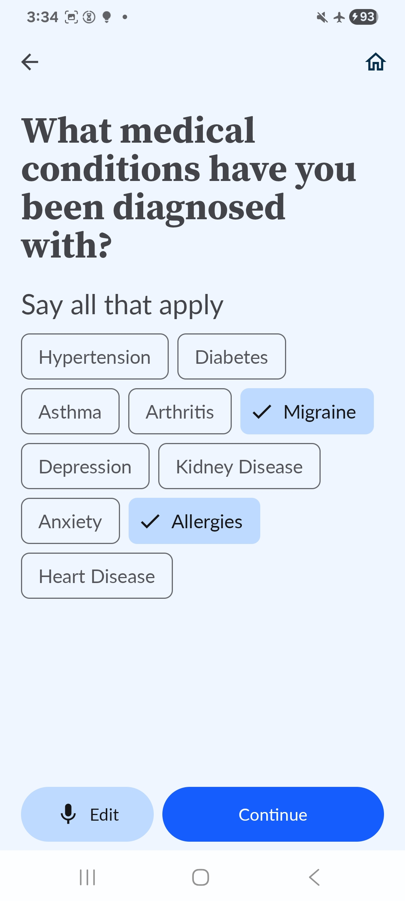
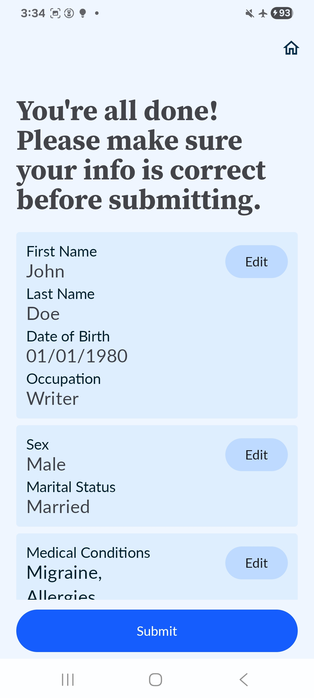
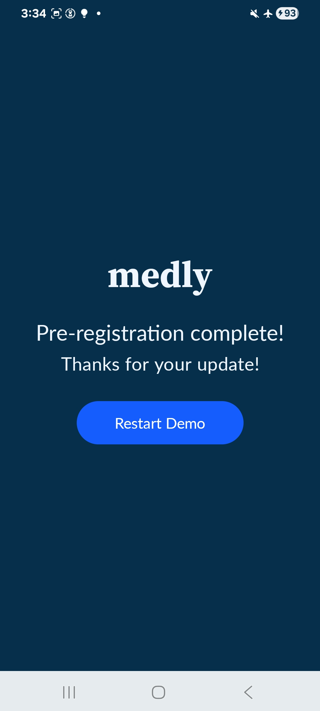

# AI Edge Function Calling: Healthcare Form Demo

## Overview

This Android application serves as a demonstration of how to integrate and
utilize Function Calling capabilities with Google's AI Edge SDK. The demo is
themed around a healthcare scenario, showcasing how natural language input can
be used to interact with a simulated healthcare form that asks a patient for
registration information.

Note: This example app will not run on an Android emulator.

## Installation

1. Download the *Hammer 2.1 1.5B* TFLite model: [`hammer2.1_1.5b_q8_ekv4096.task`](https://huggingface.co/litert-community/Hammer2.1-1.5b/blob/main/hammer2.1_1.5b_q8_ekv4096.task)

1. Push the model to your Android phone using [`adb`](https://developer.android.com/tools/adb):

    ```bash
    adb push hammer2.1_1.5b_q8_ekv4096.task /data/local/tmp/hammer2.1_1.5b_q8_ekv4096.task
    ```

1. Clone this repository.

    ```bash
    git clone https://github.com/google-ai-edge/ai-edge-apis.git
    ```

1. Open `ai-edge-apis/examples/function_calling/healthcare_form_demo` with [Android Studio](https://developer.android.com/studio).

1. Press the "Run button".

    


1. The app will start on your Android phone. 

## App User Interface

This example app is called *Medly*.

1. The home screen will ask you to complete a registration form. Tap *Complete Form*.

    

1. The first page of the form will ask for your name, date of birth, and occupation.

    

1. Tap the microphone button at the bottom and say your name, birth date, and occupation.

    - For example, "My name is John Doe, I was born on January 1, 1980, and I work as a writer."

1. The on-device model will populate the name, date of birth, and occupation fields based on what you said.

    

1. Tap *Continue*.

1. The next screen asks for demographic information.

1. Tap on *Edit* and provide the requested for information.

    - For example, "I am a married man."

1. The on-device model will populate the the *Sex* and *Marital status* fields based on what you said.

    

1. Tap *Continue*.

1. The next screen asks for your medical conditions.

1. Tap on *Edit* and say a few of the medical conditions displayed on the screen.

    - For example, "I have migraines and allergies."

1. The on-device model will select the medical conditions based on what you said.

    

1. Tap *Continue*.

1. The next screen allows you to review the entered information.

    

1. Tap *Submit*.

    - Note: No information is actually sent anywhere. This app is only a demo.

1. The final screen allows you to restart the demo and will bring you back to the home screen.

    
