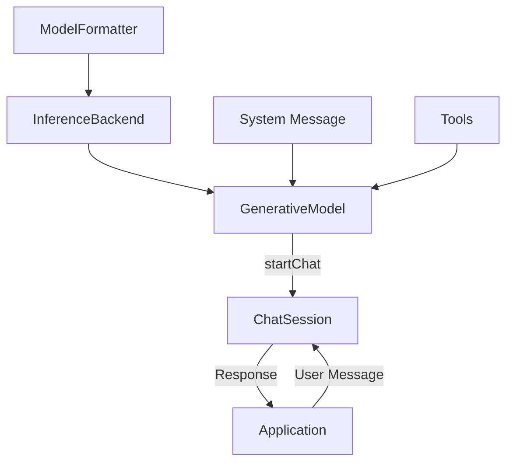
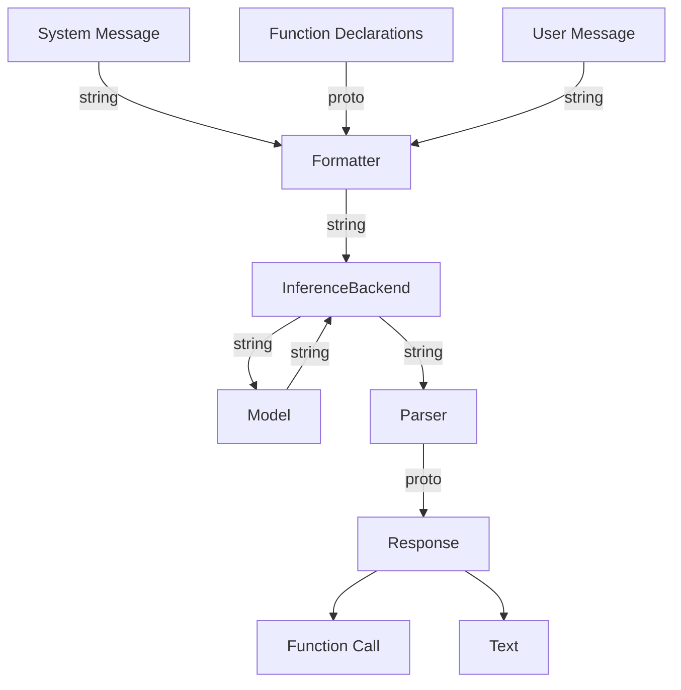

# AI Edge On-device Function Calling SDK

The AI Edge Function Calling SDK (FC SDK) is a library that enables developers
to use function calling with on-device LLMs. Function calling lets you connect
models to external tools and APIs, enabling models to call specific functions
with the necessary parameters to execute real-world actions.

Rather than just generating text, an LLM using the FC SDK can generate a
structured call to a function that executes an action, such as searching for
up-to-date information, setting alarms, or making reservations.

The AI Edge FC SDK is available for Android and can be run completely on-device
with the LLM Inference API. Start using the SDK by following the [Android guide](https://ai.google.dev/edge/mediapipe/solutions/genai/fc/android),
which walks you through a basic implementation of a sample application using
function calling.

## Guide

See our [public documentation](https://ai.google.dev/edge/mediapipe/solutions/genai/fc) for more details on the SDK's usage.

## Quickstart

In this quickstart, we'll use Hammer 2.1 1.5B and the LLM Inference API from
*MediaPipe*.

### Add dependencies

Add these dependencies to the `build.gradle` file of your Android application:

```none
dependencies {
    implementation 'com.google.mediapipe:tasks-genai:0.10.23'
    implementation 'com.google.ai.edge.localagents:localagents-fc:0.1.0'
}
```

For devices with Android 12 (API 31) or higher, add the native OpenCL library
dependency. For more information, see the documentation on the
[`uses-native-library`](https://developer.android.com/guide/topics/manifest/uses-native-library-element)
tag.

Add the following `uses-native-library` tags to the `AndroidManifest.xml` file:

```xml
<uses-native-library android:name="libOpenCL.so" android:required="false"/>
<uses-native-library android:name="libOpenCL-car.so" android:required="false"/>
<uses-native-library android:name="libOpenCL-pixel.so" android:required="false"/>
```

### Download a model

Download Hammer 2.1 1.5B in a 8-bit quantized format from
[Hugging Face](https://huggingface.co/litert-community/Hammer2.1-1.5b).

Push the model to your device:

```bash
$ adb shell mkdir -p /data/local/tmp/llm/
$ adb push hammer2.1_1.5b_q8_ekv4096.task /data/local/tmp/llm/hammer2.1_1.5b_q8_ekv4096.task
```

### Application Code

#### Define functions

Write the functions in your application that will be made available to the
model.

Here, we'll write two toy functions as static methods in a class:

```java
class ToolsForLlm {
    public static String getWeather(String location) {
        // This function returns a hardcoded response, but in reality, you would
        // make a call to a REST API or read from a database to get the actual
        // weather conditions at the given location.
        return "Cloudy, 56°F";
    }

    public static String getTime(String timezone) {
        return "7:00 PM " + timezone;
    }

    private ToolsForLlm() {}
}
```

When the model wants to call a function, your application will be responsible
for executing one of the functions above. This will be covered below, in the
section *Examine model response*.

Next, we need to describe these functions in `FunctionDeclaration` objects so
the model will know what they do and when to call them. A `FunctionDeclaration`
contains 3 critical pieces of information about the function:

1.  The function's name.
2.  A description of what the function does and when to call it.
3.  The parameters the function accepts.
    1.  The parameter name.
    2.  The parameter type.
    3.  A description of what the parameter represents and what it's used for.

These details about the function will be inserted into the system prompt for the
model so that the model knows what functions are available, when to call them,
and what parameters to pass.

```java
var getWeather = FunctionDeclaration.newBuilder()
    .setName("getWeather")
    .setDescription("Returns the weather conditions at a location.")
    .setParameters(
        Schema.newBuilder()
            .setType(Type.OBJECT)
            .putProperties(
                "location",
                Schema.newBuilder()
                    .setType(Type.STRING)
                    .setDescription("The location for the weather report.")
                    .build())
            .addRequired("location")
            .build())
    .build();
var getTime = FunctionDeclaration.newBuilder()
    .setName("getTime")
    .setDescription("Returns the current time in the given timezone.")
    .setParameters(
        Schema.newBuilder()
            .setType(Type.OBJECT)
            .putProperties(
                "timezone",
                Schema.newBuilder()
                    .setType(Type.STRING)
                    .setDescription("Returns the current time in the given timezone.")
                    .build())
            .addRequired("timezone")
            .build())
    .build();
```

Finally, add these function declarations to a `Tool` object:

```
var tool = Tool.newBuilder()
    .addFunctionDeclarations(getWeather)
    .addFunctionDeclarations(getTime)
    .build();
```

The `Tool` object will eventually be passed to the constructor of the
`GenerativeModel`, but more on that later.

#### Create the Inference Backend

Create an inference backend using LLM Inference API and pass it a
formatter/parser object for your model:

```java
var llmInferenceOptions = LlmInferenceOptions.builder()
    .setModelPath(modelFile.getAbsolutePath())
    .build();
var llmInference = LlmInference.createFromOptions(context, llmInferenceOptions);
var llmInferenceBackend = new llmInferenceBackend(llmInference, new HammerFormatter());
```

The inference backend will run inference on a TFLite model. See
[Configuration options](https://ai.google.dev/edge/mediapipe/solutions/genai/llm_inference/android#configuration-options)
for the options available in `LlmInferenceOptions`.

The formatter converts message content into a string that is appropriate for the
chosen model. The formatter also contains a parser that parses the model's
output into a data structure.

As a developer, you don't have to worry about inserting special tokens to
indicate the start and end of conversation turns, how to format function
definitions into the prompt, or how to parse the string generated by the model.

#### Create the `GenerativeModel`

The `GenerativeModel` object ties together the inference backend, system prompt,
and tools.

We already created the inference backend and tools, so let's create the system
prompt:

```java
var systemInstruction = Content.newBuilder()
      .setRole("system")
      .addParts(Part.newBuilder().setText("You are a helpful assistant."))
      .build();
```

Now we can instantiate the `GenerativeModel`:

```java
var generativeModel = new GenerativeModel(
    llmInferenceBackend,
    systemInstruction,
    List.of(tool),
)
```

Note: If you're using this Java library through Kotlin, you can't use named
arguments.

#### Start a chat session

Multiple, independent sessions can be spawned from the same `GenerativeModel`.
Here, we'll start a single chat session:

```java
var chat = generativeModel.startChat();
```

#### Send a message to the model

Send a message to the model via the chat session by calling the `sendMessage`
method:

```java
var response = chat.sendMessage("How's the weather in San Francisco?");
```

#### Examine model response

Examine the model's response to see if it wants to call a function. If it does,
call the corresponding function, otherwise, log the text.

```java
// Extract the model's message from the response.
var message = response.getCandidates(0).getContent().getParts(0);

// If the message contains a function call, execute the function.
if (message.hasFunctionCall()) {
  var functionCall = message.getFunctionCall();
  var args = functionCall.getArgs().getFieldsMap();
  var result = null;

  // Call the appropriate function.
  switch (functionCall.getName()) {
    case "getWeather":
      result = ToolsForLlm.getWeather(args.get("location").getStringValue());
      break;
    case "getTime":
      result = ToolsForLlm.getTime(args.get("timezone").getStringValue());
      break;
    default:
      throw new Exception("Function does not exist:" + functionCall.getName());
  }
  // Return the result of the function call to the model.
  var functionResponse =
      FunctionResponse.newBuilder()
          .setName(functionCall.getName())
          .setResponse(
              Struct.newBuilder()
                  .putFields("result", Value.newBuilder().setStringValue(result).build()))
          .build();
  }
  var response = chat.sendMessage(functionResponse);
} else if (message.hasText()) {
  Log.i(message.getText());
}
```

The sample code above is simplified for readability. In a realistic application,
you would also do the following:

1.  Call functions in a loop in case the model wants to call another function.
2.  Handle multiple function calls in the response: `response` can contain
    multiple `Part` objects.
3.  Handle both text and function calls in the response: The `Part` objects in
    the `response` can have a mix of `FunctionCall`s and `Text`.
4.  Handle malformed function calls:
    1.  Check if the function exists.
    2.  Check if all required arguments are provided.
    3.  Check if any parameters are hallucinated.

## What is Function Calling?

Function Calling is a Model/User/Environment interaction paradigm where a large
language model (LLM) interfaces with external tools and APIs to perform specific
actions. Instead of only generating text, the LLM can generate a structured call
to a function that can execute an action, such as searching for information,
setting alarms, or making reservations.

Function Calling enables LLMs to be more dynamic and useful by extending their
capabilities beyond text generation. It allows LLMs to interact with the real
world and perform actions that would otherwise be impossible.

## What is the Function Calling SDK?

The **Function Calling SDK (FC SDK)** is a software development kit that
provides tools and libraries to enable mobile app developers to use function
calling with **local** LLMs. It simplifies the process of creating and managing
functions, as well as interacting with LLMs to execute these functions.

-   **Function Declarations:** This involves defining the structure and
    parameters of the functions that the LLM can call. This includes specifying
    the function name, parameters, and their types.
-   **LLM Interaction:** The FC SDK provides the necessary tools to interact
    with the LLM. This includes sending prompts to the LLM, receiving function
    calls, and providing the results of function execution back to the LLM.

The main pieces of the FC SDK are:

-   `ModelFormatter` controls how function calling data structures are converted
    to and from strings.
    -   In order to use a model with the FC SDK, there must be a corresponding
        implementation of the `ModelFormatter` interface, e.g. `GemmaFormatter`
        for the Gemma models, `HammerFormatter` for the Hammer models.
    -   The `ModelFormatter` implementations contain model-specific knowledge
        about how various models expect to receive input and how they format
        function calls.
-   `InferenceBackend` uses the `ModelFormatter` to format the input data
    structure (a `Content` proto) into an input string and passes that string to
    the model to generate a response.
    -   An example of an `InferenceBackend` is `LlmInferenceBackend`, which uses
        the LLM Inference API from *MediaPipe Tasks* to run inference on TFLite
        models.
-   `GenerativeModel` ties together the `InferenceBackend`, system message, and
    tools.
-   `ChatSession` is spawned from a `GenerativeModel` and represents a
    conversation between the model and the user.
    -   Sessions are independent, but they use the same `InferenceBackend`,
        system message, and tools that were initialized in the parent
        `GenerativeModel`.
    -   The message history is tracked as `Content` protocol buffers and the
        key-value vectors are cached by the inference backend.
    -   Your application should use a `ChatSession` for each multi-turn
        conversation with the user.

<!-- disableFinding(SNIPPET_INVALID_LANGUAGE) -->


## Key components

The FC SDK contains to following key components:

*   **Inference Backend**: An interface for running inference on a generative AI
    model. The FC SDK uses the LLM Inference API to execute inference on LiteRT
    (TFLite) models. The API uses the [InferenceBackend](https://github.com/google-ai-edge/ai-edge-apis/tree/main/local_agents/function_calling/java/com/google/ai/edge/localagents/fc/InferenceBackend.java) interface.
*   **Prompt Formatter**: An interface for formatting requests and responses to
    and from the Generative AI model. The FC SDK provides a formatter that
    converts function declarations into the model-specific format required by
    the LLM and inserts them into the system prompt. The formatter also handles
    model-specific tokens to indicate user and model turns. The API uses the
    [ModelFormatter](https://github.com/google-ai-edge/ai-edge-apis/tree/main/local_agents/function_calling/java/com/google/ai/edge/localagents/fc/ModelFormatter.java) interface.
*   **Output Parser**: The FC SDK provides a parser that detects if the model's
    output represents a function call and parses it into a data structure for
    use by the application. The API uses the [ModelFormatter](https://github.com/google-ai-edge/ai-edge-apis/tree/main/local_agents/function_calling/java/com/google/ai/edge/localagents/fc/ModelFormatter.java) interface.
*   **Constrained Decoding**: An interface for creating and managing constraints
    to ensure that the generated output adheres to specific rules or conditions.
    For supported models, the FC SDK will configure the inference backend to use
    constrained decoding, which ensures that the model only outputs valid
    function names and parameters. The API uses the [ConstraintProvider](https://github.com/google-ai-edge/ai-edge-apis/tree/main/local_agents/function_calling/java/com/google/ai/edge/localagents/fc/ConstraintProvider.java)
    interface.

## Function calling pipeline

Setting up an on-device LLM with function calling capabilities requires the
following key steps:

1.  **Define function declarations**: The structure and parameters of the
    functions that the LLM can call must be defined in your application code.
    This includes specifying function names, parameters, and types.
1.  **Format prompts and outputs**: Input and output text can contain natural
    language and function calls. A formatter controls how data structures are
    converted to and from strings, enabling the LLM to appropriately format
    information.
1.  **Parse outputs**: A parser detects if the generated response contains a
    function call and parses it into a structured data type so that the
    application can execute the function call.
1.  **Examine responses**: If the parser detects a function call, the
    application calls the function with the appropriate parameters and
    structured data type. Otherwise, it returns natural language text.

## Formatting and Parsing

A key part of function calling support is the formatting of prompts and parsing
of model output.

The formatter is responsible for:

-   Converting the structured function declarations into text, according to the
    format the model was trained on.
-   Inserting tokens to indicate the start and end of conversation turns, as
    well as the roles of those turns (e.g. "user", "model").
-   Formatting function responses provided by the app.

After receiving the prompt, the model generates a response as a string. This
response can represent either a natural language message or a function call.
Natural language messages are simply plain text. Function calls are usually
indicated by special syntax, such as three consecutive backticks, depending on
the model and how it was trained.

The parser detects if the response contains a function call and parses it into a
structured data type. All other text is treated as part of the natural language
response.

Because every model is trained with their own formats for function declarations
and calls, each model requires its own formatter and parser. In the FC SDK, the
formatter and parser are contained in the implementations of the
`ModelFormatter` interface.



## Constrained Decoding

Constrained decoding is a technique employed to guide the output generation of
Large Language Models (LLMs), ensuring adherence to a predefined structured
format. This method guarantees that the LLM's output conforms to specific
patterns, such as JSON objects or Python function calls, thereby facilitating
seamless parsing and utilization by downstream systems. By enforcing these
constraints, the LLM is guaranteed to produce outputs that align with the
predefined functions and their corresponding parameter types.

Note: Only Gemma and Gemini models support constrained decoding in FC SDK.

To enable constrained decoding, begin by creating a `ConstraintOptions` object.
Subsequently, invoke the `enableConstraint` method of a `ChatSession` instance,
which is obtained from a `GenerativeModel` object. When enabled, this constraint
will restrict the LLM's response to only include the tools associated with the
`GenerativeModel`.

The following Java example demonstrates how to configure constrained decoding to
exclusively allow tool calls in the LLM's response. It constrains the tool call
to start with the prefix ```` ```tool_code\n```` and end with the suffix
````\n``` ````.

~~~java
ConstraintOptions constraintOptions = ConstraintOptions.newBuilder()
            .setToolCallOnly(
                ConstraintOptions.ToolCallOnly.newBuilder()
                    .setConstraintPrefix("```tool_code\n")
                    .setConstraintSuffix("\n```"))
            .build();
chatSession.enableConstraint(constraintOptions);
~~~

To disable the active constraint within the same session, use the following
method:

```java
chatSession.disableConstraint()
```

### Constraint Options

`ConstraintOptions` offers three modes for controlling the LLM's output

-   `ToolCallOnly`

    This mode restricts the LLM's response to exclusively contain tool calls.
    Optionally, the tool calls can be wrapped by `constraint_prefix` and
    `constraint_suffix`.

-   `TextAndOr`

    This mode allows the LLM's response to include text, tool calls, or a
    combination of both. Once the defined `stop_phrase_prefix` and
    `stop_phrase_suffix` are encountered during generation, the LLM will cease
    generating further text and will only produce tool calls. The final response
    will end with `constraint_suffix`.

-   `TextUntil`

    This mode permits the LLM to generate either tool calls exclusively or text
    preceding tool calls. Upon encountering the `stop_phrase`, the LLM will stop
    generating text and will subsequently only generate tool calls. The response
    will end with `constraint_suffix`.

    Note: `TextUntil` differs from `TextAndOr` in that `TextUntil` will always
    contain tool calls but `TextAndOr` may only contain text.

## Error Handling

When the model attempts to call a function, the FC SDK will automatically check
the validity of the function call.

1.  The function name must match a function declared in tools.
2.  The parameters names must match the parameters declared for the function.
3.  All required parameters must be present.

If any of the above conditions is unsatisfied, `ChatSession.sendMessage()` or
`GenerativeModel.generateContent()` will throw a `FunctionCallException`.

The kind of error is indicated by the `FunctionCallStatus` enum returned by
`FunctionCallException.getStatus()`, which will have one of the following
values:

1.  `INVALID_FUNCTION_NAME` if the function name in the `FunctionCall` does not
    match any function declarations in `GenerativeModel.tools`,
2.  `INVALID_PARAMETER_NAME` if an argument in `FunctionCall.args` does not
    match a parameter key in `FunctionDeclaration.parameters`.
3.  `MISSING_REQUIRED_PARAMETER` if a required parameter is missing (i.e. a
    parameter declared in `FunctionDeclaration.parameters.required`).
